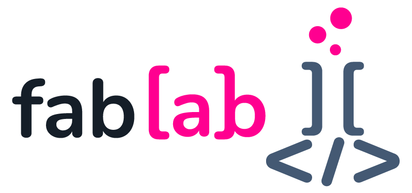
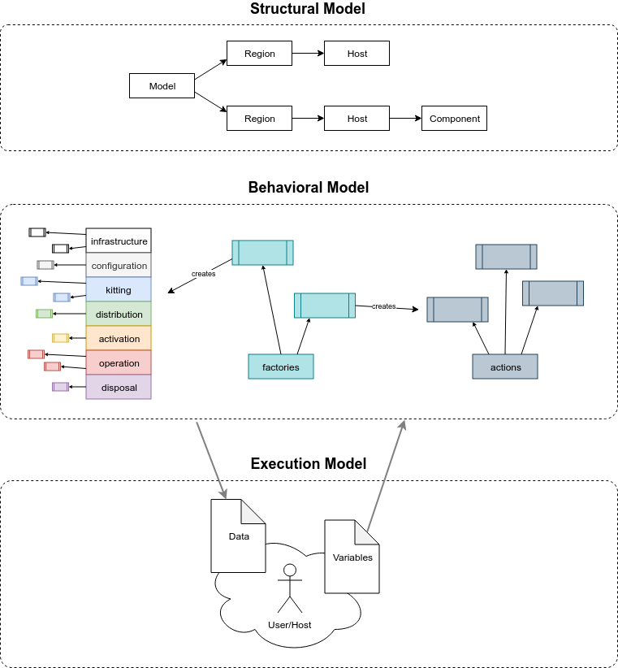

# Welcome to the Fabulous Laboratory

_(This is a work-in-progress document where sections may end randomly and abrubptly. Stay tuned)_

The Fabulous Laboratory (`fablab`) is incubating an evolved set of tooling addressing operational development concerns for large-scale, distributed deployment models. These tools are being created to directly address the needs of creating, deploying, researching, and managing geo-scale Ziti networks in development and testing environments. We also foresee these tools being useful beyond our specific purpose, and finding uses in many areas of operational development.

## "As Code" as Actual Code

A great number of "as code" tools use hobbled, miserable DSLs (or they repurpose structured markup like YAML or JSON) to express their structures. These can be useful, up until the point where you need to start remotely operating and controlling these systems with any kind of complex choreography, where these DSLs break down, badly. To compensate, you might end up stringing together multiple disparate layers of tooling to assemble a [Rube Goldberg](https://en.wikipedia.org/wiki/Rube_Goldberg) contraption to meet all of your needs.

_Programmers_ solved these kinds of problems long ago with general purpose programming languages. A reasonable general purpose progamming stack, equipped with strong extension points (a "framework") is much better "glue" than trying to assemble different self-contained systems using scripts and cron jobs (even if they're disguised as microservices) to meet the entirety of your operational needs.

`fablab` is a _programming_ framework, implemented in `golang`, which seeks to support the creation of self-contained, concise, repeatable, expressive, workflow-laden operational tools. We anticipate that `fablab` will have roles across the entire operational spectrum, from conception to retirement.

`fablab` is designed to support the development and exploration of programming models for geo-scale, distributed systems.

## The Components of fablab

Like many other software tools that offer multiple degrees of freedom and extensibility, `fablab` is best described as a set of orthogonal ideas, which combine to facilitate extremely powerful, extensible software concepts. In order to understand the entirety of `fablab`, you'll want to make sure you understand each of the core capabilities that it provides.

Once you've grokked each of these ideas, you'll begin to see how they can be combined to create extremely powerful implementations, which dovetail seamlessly into your development environment.

	

### The Model

All `fablab` environments are represented by a "model" (`model.Model`). The model contains all of the data structures (`model.Host`, `model.Region`, etc.), static definitions (`model.Scope`, etc.), dynamically (late) bound components, and the logic (`model.Action`, lifecycle stages (`model.InfrastructureStage`, etc.), `model.Factory`) that comprise the entirety of your distributed system.

`fablab` also includes a comfortable, convenient command-line user interface, which makes working with and manipulating instances of models very convenient and simple. The `fablab` command-line interface is conceptually similar to tools like `docker`, where you can manage and work with multiple runtime environments ("model instances") from a host (typically a developer workstation).

Conceptually, `fablab` breaks these architectural concepts into three layers: the "structural model", the "behavioral model", and the "instance model".

### The Structural Model

The structural model maintains a "digital twin" of the distributed environment as a set of data structures in `golang`. You define the structure and configuration of your distributed deployment by arranging components from the `model` package (`model.Model`, `model.Region`, `model.Host`, etc.) into a hierarchy that matches your design.

You can generate your `Model` statically in code, or programmatically, in response to any stimulus you might want to observe from code. You can reconfigure the shape of your `Model` according to stimulus as well.

### The Behavioral Model

`fablab` provides a rich set of interfaces, which define the contract between the structural model, and the behaviors implemented for that model. There are a core set of concepts support intrinsicly as part of a `fablab` model, these include:

#### Factories

`fablab` uses a collection of `model.Factory` instances, wired into your model, to contain and manage the code related to building the model itself. These modules have clear interfaces, and a specific role inside of `fablab`, focused on constructing the components of your model.

#### Lifecycle Stages

`fablab` models have a lifecycle that consists of a number "stages" that an "instance" of the model can progress (forward and backward) through. Each of the lifecycle stages focus clearly (and orthogonally) on a specific portion of the life of a model instance. `fablab` provides interfaces that define the contract that must be fulfilled by lifecycle stage bindings. See `model.InfrastructureStage`, `model.ConfigurationStage`, etc. for more details.

#### Actions

`fablab` provides a general-purpose programming facility for developing and packaging discrete functions against a model. The `model.Action` interface defines a component model, which can execute against a model independently of the lifecycle.

Actions are useful for supplying your models with coherent, specific functions that end-users can run against their instances of your model.

### The Instance Model

`fablab` provides an instance model, which can be used to manage many instances of models, maintaining the unique operational and data state of the model against a specific set of systems in your hosting environment. Users of your `fablab` model can create instances, which `fablab` will express concretely in one or many hosting environments.

The instance model includes command-line tools for managing model instances, as well as interacting with the data that goes into and out of those models from the environment.

### The Kernel

The `fablab` "kernel" includes all of the low-level components and concepts that the various behavioral model components can be constructed from.

The kernel includes primitives for remote puppetry using `ssh`, along with reliable, easy-to-use mechanisms for interacting with operating systems, whether local or remote. It can be extended to integrate with anything that can be controlled from code.

## Getting Started with the Examples

See the [Getting Started with the Examples](docs/examples.md) guide for details about how to get started with the stock example models.